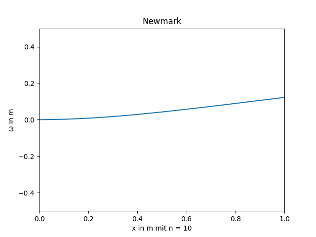
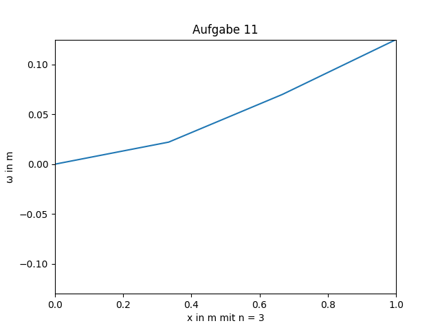
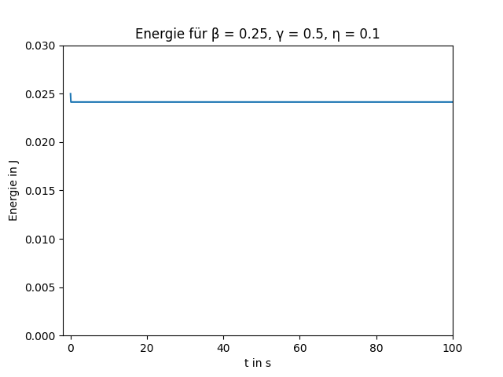
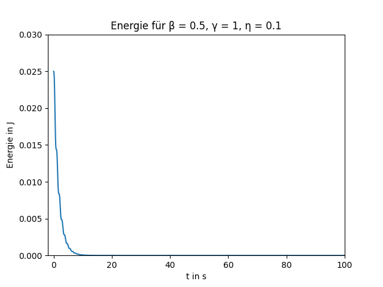
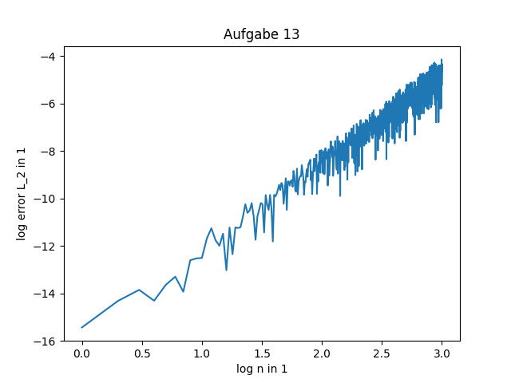
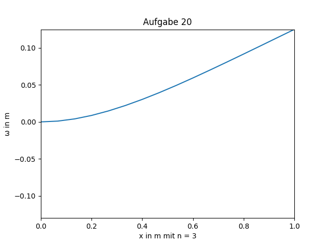

# Entstanden im Rahmen des Balkenbiegung-Projekts in "Numerische Mathematik 1 für Ingenieure"

Balkenbiegung

Aufgabe 11

Energie mit beispielhaften Newmark-Koeffizienten

Fehler im log-log-diagramm

Biegelinie des komplizierten Balkenproblems mit 5 Auswertungspunkten pro Element

